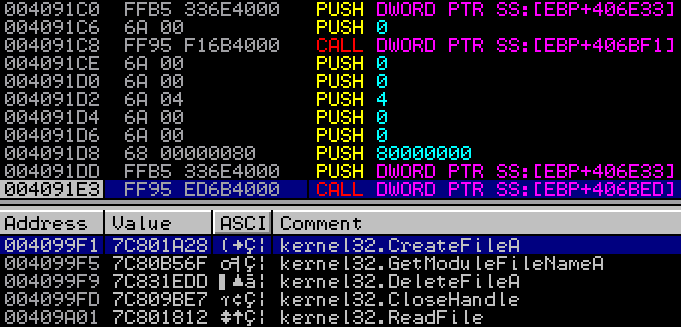
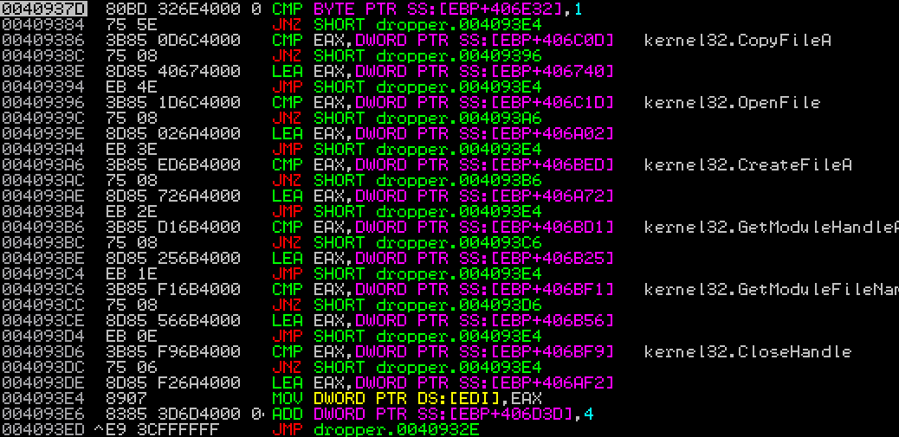
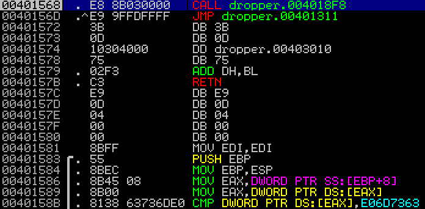

# Anti-Analysis Demo

Anti-debugging tricks leverage the abnormal execution of debugged applications. Examples of such behavior are:
- Slower than normal execution
- Presence of Breakpoints
- OS debugger flags and API calls
- Interrupt/Exception Behavior

See [How Debuggers Work](HowDebuggersWork.md).

## Unpacking dropper.EXE

Open up PEiD and drag `dropper.EXE` into the PEiD window. A signature has detected:
```
    PolyCrypt PE 2005.06.01 -> JLab Software
```
The packer is old, but it uses tricks that are still relevant today.

### Getting Started

1. Load dropper.exe into into Immunity Debugger
  - The entrypoint is a bit unusual. We see a call, and a jump into the middle of an instruction.
1. Step into the first call
  - `esi` gets the stack pointer
  - `eax` gets top stack value (return pointer) from `esi` (`LODSD`)
  - `cl` (`ecx`) gets `0xFF`, an index/counter for the `LOOPD`


1. Add breakpoint (`F2`) at `0x0040900C`
1. Run to the break (`F9`)
1. Step past `ret` and `jmp`
  - Note the similar `call`/`loop` structure, verify no exits to other code
1. Add breakpoint (`F2`) at `0x00409027` and run (`F9`)
1. And we face yet another loop (`ecx=0x5f7` indicates a significant number of iterations). Run until break again.

#### Bumps in the road
We've decode a bunch of code, but it seems we've just begun. Why do I say this?

- The only unexplored code that has been decoded is 0x5f7 bytes long (a small fraction of the code file size)
- Imports haven't been resolved

Now the fun begins!


### Exception! FS:[0]

The next code segment is a bit more complex. We see:
- It has several references to from the FS register
  - The code reads and writes FS:[0] ) (Head of the Structured Exception Handling chain)
  - The memory reference ''DWORD PTR SS:[EBP+4066AD]'' becomes the new exception handler
```
EXCEPTION_CHAIN
```
- The code references memory at address `DWORD PTR DS:[ECX]` (where `ecx` is zero), a common intentional exception


- Generally the debugger intervenes when an exception occurs. This can cause us to lose our place and have to start over
- Press Ctrl-G to bring up the Jump by Expression dialog
  - Enter `EBP+4066AD` into the box


  - This restores esp to its pre-exception state
  - It removes the current exception handler from the chain
  - It also adds 4 bytes to the stack pointer leaving the value that was push on line 0040907E
  - This leaves 00409094 on the stack for the return
- Jump to 00409094, place a breakpoint, and run to it

#### Debugger Exception Configuration
Debuggers often allow the user to break on exceptions and (debugger takes control) or pass the exception to the application. In Immunity Debugger:
1. Click the `Options` menu -> `Debugging Options`
2. Choose the `Exceptions` tab
3. Check the boxes for any exceptions the application should handle
   - If the exception is not listed, Click `Add Range`
   - Select the `First exception in range`
   - Select the `Last exception in range` to include
   - Click OK
4. Click OK

In dropper.EXE, the exceptions could be bypassed by ignoring `Memory access violation` exceptions.


### Debug Flags

- We are faced with another SEH trap. Once again, we can break inside the exception handler:


- This begins by accessing `FS:[30]` (the PEB), and then tests the 3rd byte (+2) to determine if it is not zero.


  - This is a common check for the PEB.IsDebugged flag. A common anti-debugging trick.
  - We can use the hidedebug plugin:


- Now we can step past such blocks without a care.


### More SEH

- The handler accesses a CONTEXT struct (at `SS:[EBP+10]`) which contains CPU state at the time the exception occurred.
- EIP is read into EDX and EBP is subtracted from that.
- The resulting value is compared with 0x004062A0:


- `DS:[EAX+B0]` receives 0x401000. Here the debugger repairs the register that caused the exception. EAX will be in 0x401000 on return from the handler.
- Control will return to faulting instruction.</pre>


### A Bad Pill

Anti-Virtual Machine techniques may be used by malware authors, although they must take into consideration their targets. If the target is a commodity home computer, it is more likely as they are less likely to be using virtual machines.

#### RedPill

Polycrypt was created at a time when VM Detection was a hot topic. Observe the following code in dropper.EXE after the first 3 decode loops have executed:


- This is the (in)famous Red Pill reported by the invisiblethings blog years ago. It:
  - executes the SIDT instruction (which returns the Interrupt Descriptor Table Address/Size)
  - Checks that the IDT address is within a given range known to VMWare and VirtualPC.
  - Aborts normal execution if check succeeds
- Results are unreliable in Multi-core processors as each core returns a different value, thus ~RedPill can result in false-positives

#### Other methods

- NoPill uses the SGDT instruction
- Other instructions exist (sldt, smsw, cpuid, etc) that have been exploited to "detect" VMs
- Searching for VMWare Tools Process and Files


### Anti-Dump

Looking ahead in the code, we see a series of push/call sequences, and the calls are made through memory locations (API calls?).



#### Memory Dump

The dump pane (below the assembler window) allows can help us inspect the pointers being accessed through EBP.

- Right-click inside the dump pane
- Choose Long -> `Address with ASCII dump` from the right-click menu
  - This view wil display 4-byte integer values (Little Endian) and the ASCII representation
  - It also displays call function identifiers when the integer value is a pointer to a function
- Jump to Expression (Ctrl-G) `EBP+406BED`
  - You'll find that this location contains a pointer to `CreateFileA`
  - The following location (`EBP+406BF1`) refers to `GetModuleFileNameA`

#### Analyzing the parameters

The `GetModuleFileNameA` call pictured first takes two parameters (Remember, function arguments are pushed in reverse order):

1. 0 (zero) indicates we want the name to the current file
2. `DWORD PTR SS:[EBP+406E33]` is a pointer where the file name will be stored

The `CreateFileHandleA` call pictured takes 7 parameters, but the most critical are the first and 3rd:

- The file name stored in previous call is passed first
- The 3rd parameter is the dwShareMode, which is set to 0 (zero)
  - dwShareMode of zero instructs the OS to prevent other processes from accessing the file

OllyDumpEx and other process dumping tools read the header of the executable file on disk to get the PE headers. By gaining exclusive access of the file, the unpacker has prevented dumpers from reading the file, resulting in failure.


### API Hooks



One of the unusual behaviors of this unpacker is its API Hook option. If enabled, the unpacker hooks certain API calls (e.g. CreateFileA), replacing the function points of the API calls with pointers to functions bundled with the unpacking stub.

**Why Hook?**
- Prevent protections from breaking the application
  - When anti-dump (file locking) is enabled, this allows the protected process to access the file
- Overwrite hooks created by monitoring tools

**Bypass**
- A simple memory patch can be applied to integer stored at `EBP + 406D35`, replacing a 1 with a zero (assuming this option has been selected).


### Wrapping Up

#### Tail transition

Unpacking can require some trial and error. We often can make educated guesses as to where transitions from unpacker code to the application to speed up the process. If we scroll through the code, we eventually encounter the following:


This is consistent with exit code, because it:
- restores the base pointer,
- restores all registers and flags (popad, popfd), and
- sets up the return value with a push/return sequence.

Oddly enough, the pushed value is 0. For now it appears this code returns to address 0 (zero), but if we create a breakpoint (ideally hardware) on the return (this will take some patience):


You'll notice the push instruction now has the value `dropper.00401568` in place of zero.

**Why was that so slow?**

If you look at the log window, you'll notice lots of messages about int3 instructions being reached. As the unpacker decrypts the application code, EIP repeatedly reaches a lot of these int3 (0xCC), which causes a brief context switch to the debugger, causing a slow down. We can risk replacing the 0xCCs with NOP (0x90) instructions (at risk if the code is used in the decryption calculations), or we can let it run its course.

#### Original Entry Point

If we step past the return instruction, we find the following:


The debugger has not yet diassembled this code, so we force this with Ctrl-A:



This looks like the Original Entry Point, commonly refered to as the OEP. Dump it with OllyDumpEx, and if you're not sure, you can leave the debugger running while you take a look at things in IDA (and perhaps try to execute the dumped file).
